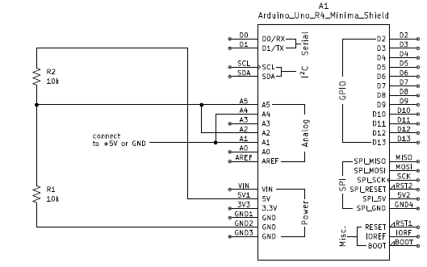
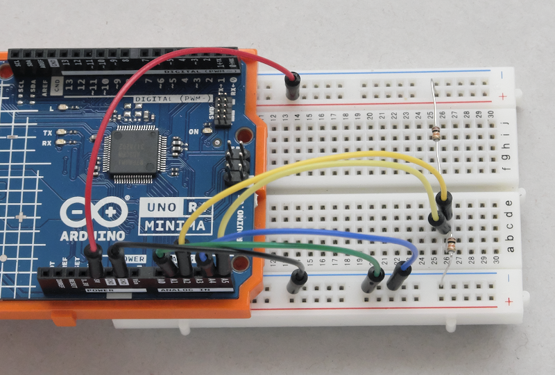

# ad_conversion_test

## 目的 / Purpose
Arduino UNO R4（RA4M1）でAD変換のサンプリング時間を変えて、変換の精度へどう影響するかが確認できます。  
このリポジトリは、サンプリング時間、電圧源のインピーダンス、外部コンデンサがAD変換の結果にどのように影響するかを示す、実験用のコードと回路図を提供します。  
Observe how ADC sampling time (ADSSTR) affects conversion accuracy on Arduino UNO R4 (RA4M1).  
This repository provides experimental code and schematic to demonstrate how sampling time, source impedance, and external capacitors influence ADC results.  

---

## 回路図 / Schematic Diagram
  
  

---

## ピン接続
- プリチャージするためのチャネル A1、A4：  
GNDまたは+5Vに接続します（サンプルホールドコンデンサのプリチャージに使用）  
- 測定対象のチャネル A2 (高精度チャネル)、A5 (標準精度チャネル) ：  
+5VとGNDを分圧する10kΩ/10kΩの中間点 (理論上2.5V) に接続します  
- オプションのコンデンサ：  
サンプリング時間が短い場合、コンデンサがないと精度が悪くなる場合があります  
A2/A5とGNDの間に0.01μFを加えると、精度の変動が改善されます  
小さい値(例：1000nF=0.001μF)では、チャージが減少し顕著なオフセットが発生する可能性があります  
- Precharge channels A1 and A4:  
connect to GND or +5V (used to precharge the sample-hold capacitor).  
- Measurement channels A2(High-precision channel) and A5(normal-precision channel):  
connect to midpoint of a 10kΩ/10kΩ divider between +5V and GND (theoretically 2.5V).  
- Optional capacitor:  
No connection of capacitor may be poor accuracy at the short sampling time.  
Add 0.01µF between A2/A5 and GND to improve stability.  
Small values (e.g., 1000nF = 0.001µF) may cause noticeable offset by its charge depletion  

---

## 使い方 / Usage
- `ad_conversion_test.ino`をUNO R4 MINIMAに書き込みます  
- 10kΩ/10kΩの分圧抵抗を上に示すようにピンに接続します  
- シリアルモニタを115200bpsに設定して接続します 
- 変換結果を確認します  
最初に、デフォルト値 (ADSSTR=13)でのanalogRead()の値が出力されます  
次に、A2とA5のADSSTRを変化させながら変換します  
ADSSRを変化させた時の結果が出力されます  
- A1とA4の接続のGND/+5Vを変更し、変換結果を確認します  
- Upload `ad_conversion_test.ino` to Arduino UNO R4 Minima  
- Connect 10kΩ/10kΩ divider to pins as described above  
- Open Serial Monitor at 115200 bps  
- Observe conversion results:  
First, default analogRead() values are printed (ADSSTR=13)  
Then, ADSSTR is swept across a range while converting A2 and A5  
Results of value while swept ADSSR are printed  
- change A1 and A4 connection to GND/+5V, and observe conversion results again  

---

## ポイント / Key insights
- サンプリング時間が短いと、電圧源のインピーダンスが中程度/高い場合には測定に表れる誤差が発生します。  
- サンプリング時間を長くすると、予期される電圧の近くで読み取り値が安定します。  
- 外部コンデンサは電圧差を低減できますが、帯域幅または応答の問題のないよう慎重な選択が必要です。  
>テクニカルノート  
>- デフォルトでのanalogRead()：  
>サンプリング時間設定がADSSTR=13のままとすると、結果は前のチャンネル (より低い/より高い) に引っ張られることがあります。  
>- サンプリング時間設定ADSSTRを変更：  
>サンプリング時間が長くなると、結果は10kΩ/10kΩで分圧された電圧 (2.5V) 付近に収束します。  
>- 外部コンデンサ:  
>0.01μFの付加は電圧の差を低減し、測定値を安定させます。  
>コンデンサ(例えば0.1μF)が大きいほど安定性はさらに向上しますが、帯域幅と応答速度にはトレードオフがあります。  
>- 設計上のポイント:  
>AD変換の精度は、サンプリング時間、電圧源のインピーダンス、および入力容量に共に関連して依存します。  
>10kΩ/10kΩの分圧抵抗のようにソースインピーダンスが中程度/高い場合には、初心者は再現性のある結果を得るためにより長いADSSTR値から始めるのが良いです。  
- Short sampling time causes measurable error when source impedance is moderate/high.  
- Longer sampling times stabilize readings near the expected voltage.  
- External capacitors can reduce voltage difference but require careful selection to avoid bandwidth or response issues.  
>Technical Notes  
>- Default analogRead():  
>With ADSSTR=13 is still assumed, results may be pulled toward the previous channel (lower or higher).  
>- ADSSTR sweeping:  
>As sampling time increases, results converge near the midpoint of 10kΩ/10kΩ divider voltage (2.5V).  
>- External capacitor:  
>Adding 0.01µF reduces voltage difference and stabilizes readings.  
>Larger capacitors (e.g., 0.1µF) improve stability further, but trade-offs exist in bandwidth and response speed.  
>- Design takeaway:  
>AD conversion accuracy depends jointly on sampling time, source impedance, and input capacitance.  
>Beginners should start longer ADSSTR values for reproducible results if source impedance is moderate/high, such as a 10kΩ/10kΩ divider.  

---

## 必要な環境 / Requirements
- Arduino IDE（最新版推奨） / Arduino IDE (latest recommended)  
- Arduino UNO R4 MINIMA / Arduino UNO R4 MINIMA  
- 分圧抵抗の10kΩを2本、適当な値のコンデンサ / 10kΩ/10kΩ dividing resistors and appropriate capacitor  

---

## License
Copyright (c) 2025 inteGN - MIT License  

