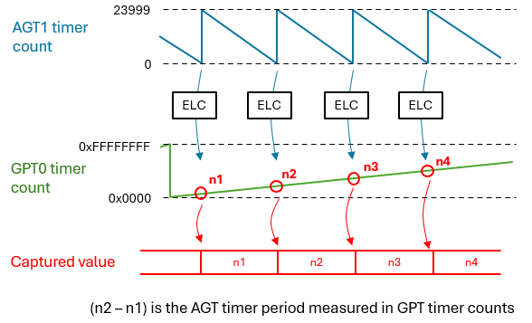
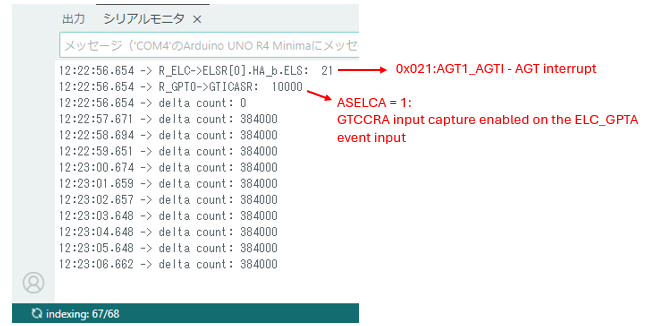

# agt_and_elc_setup_test

## 目的 / Purpose
このリポジトリは、Arduino UNO R4 (RA4M1) でAGTタイマーを設定し、その周期ごとにイベントを発行するプログラム例を提供します。  
さらに、イベントをGPTタイマーのインプットキャプチャのトリガーとし、GPTのカウント値からAGTの周期を測定し表示します。  
This repository provides an example program for configuring the AGT timer and generating periodic event requests on the Arduino UNO R4 (RA4M1).  
The example also configures the GPT timer input‑capture, which is triggered by the event from the AGT timer, and displays the AGT timer period in GPT timer counts.  

---

## ピン接続 / Pin connection
- 不要  
- Not required  

---

## 使い方 / Usage
- `agt_and_elc_setup_test.ino` をUNO R4 MINIMAに書き込みます  
- シリアルモニタを115200bpsに設定して接続します  
- 結果を確認します  
- Upload `agt_and_elc_setup_test.ino` to UNO R4 MINIMA  
- Open Serial Monitor at 115200 bps  
- Observe the results  

---

## ポイント / Key insights

  

AGTタイマーは周期ごとにイベントリンクを発行します。  
そのイベントはELCによってGPTのインプットキャプチャに接続され、キャプチャをトリガーします。  
キャプチャした値とひとつ前の値の差から、GPTでカウントしたAGTの周期が求められます。  
Timer AGT issues an event every period.  
The event is routed through the ELC and triggers input‑capture of the GPT timer.  
The period of the AGT timer is calculated from the difference between the current and previous captured values.  

 

  

イベントリンク関連のレジスタ設定を最初に表示します。  
次に、GPT タイマーのカウント値で測定した AGT タイマーの周期を表示します。この例では 384,000 カウントになるはずです。  
この結果から、AGT タイマーは 23,999 から 0 までカウントし、begin() に 24,000 を指定するとリロードレジスタに 23,999 が設定されることがわかります。  
The program first prints the event‑link related register settings.  
Then it shows the AGT timer period measured in GPT timer counts. In this example, the expected value is 384,000.  
From this result, we can see that the AGT timer counts from 23,999 down to 0, so specifying 24,000 in begin() sets the reload register to 23,999.  

---

## 必要な環境 / Requirements
- Arduino IDE（最新版推奨） / Arduino IDE (latest recommended)  
- Arduino UNO R4 MINIMA / Arduino UNO R4 MINIMA  

---

## License
Copyright (c) 2026 inteGN - MIT License  

