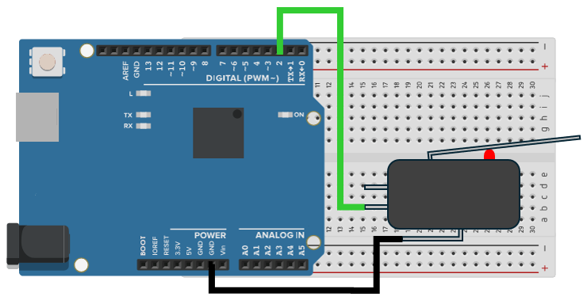

# led_output_response_test

## 目的 / Purpose
Arduino UNO R4 MINIMAを使って、ループ処理と割り込み処理のレスポンスの違いを観察できます  
時間的な制約があるタスクにおいて、割り込み処理を使うことの重要性を示します  
Observe how interrupt response differs from loop-based control on Arduino UNO R4 MINIMA.  
This example demonstrates the importance of using interrupts for time‑critical tasks.  

---

## 配線図 / Wiring Diagram
  
ピン接続  
- 押しボタンスイッチをUNO R4 MINIMAのD2ピンとGNDピンに接続  
- ボード上のLED_RXとLED_TXで出力を表示

Pin connections  
- push button switch to the pin D2 and GND of UNO R4 MINIMA  
- On‑board LED_RX and LED_TX are used for output indication  

---

## 使い方 / Usage
- 自作割り込みライブラリをインストールします  
- 押しボタンスイッチをUNO R4 MINIMAに接続します  
- `led_output_response_test.ino` をUNO R4 MINIMAに書き込みます  
- スイッチを押してボード上のLED_TXとLED_RXの挙動を観察します

- Install the custom library  
- Connect a push button switch to UNO R4 MINIMA  
- Upload `led_output_response_test.ino` to UNO R4 MINIMA  
- Press the switch and observe on-board LED_TX and LED_RX behavior  

---

## ポイント / Key insights
- 割り込みではスイッチの読み取りとLED_RXのオン、オフに即座に反応できる  
- loop処理で行うLED_TXのオン、オフは長いSerial1.print()タスクで遅延する  
- この例は時間的な制約があるタスクにおいて割り込みを使う重要性を示す  
- Interrupts allow immediate response to switch read and LED_RX turn on/off  
- Loop-based LED_TX turn on/off control can be delayed by long Serial1.print() task  
- This example highlights the importance of using interrupts for time-critical tasks  

---

## 必要な環境 / Requirements
- Arduino IDE（最新版推奨） / Arduino IDE (latest recommended)  
- Arduino UNO R4 MINIMA / Arduino UNO R4 MINIMA  
- 押しボタンスイッチと接続線 / a push button switch and electrical wire  

---

## ライブラリのインストール / Library Installation
このプログラム例では、GPTタイマーとその割り込みの設定のために自作ライブラリが必要です。  
プログラムを実行する前に、以下のリポジトリから取得しインストールしてください：  
This example requires a custom library for timer GPT and its interrupt handling.  
Please get it from the following repository the program and install before running:  

https://github.com/inteGN/GPT_basicfunction_R4  

---

## 参考 / Reference
動作中の動画 / video showing the behavior (Japanese caption only)  
  

---

## License
Copyright (c) 2025 inteGN - MIT License  

