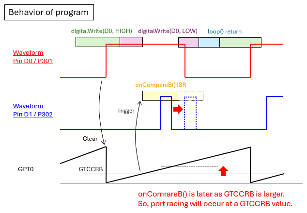
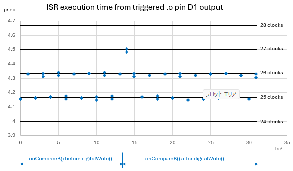

# port_racing_condition_test

## 目的 / Purpose
Arduino UNO R4（RA4M1）で、loop()内のdigitalWrite()とISRでのポートアクセスが同時に発生した時に、GPIO出力がどのように変更されるかが確認できます。  
このリポジトリは、digitalWrite()がハードウェアレベルでGPIOピンを更新する方法を調べるための、Arduino UNO R4用の最小限のテストプログラムを提供します。  
Observe how GPIO outputs are changed while a collision with `digitalWrite()` in loop() and ISR port access at a same time on Arduino UNO R4 (RA4M1).  
This repository provides a minimal test program for Arduino UNO R4 to investigate how `digitalWrite()` updates GPIO pins at the hardware level.  

---

## ピン接続 / Pin connection
- D0ピンとD7ピンを接続する  
- D0ピン(P301) → オシロスコープ CH1  
- D1ピン(P302) → オシロスコープ CH2  
- Connect pin D0 and D7(P107)  
- Connect pin D0(P301) to CH1 probe of oscilloscope  
- Connect pin D1(P302) to CH2 probe of oscilloscope  

---

## 使い方 / Usage
- `port_racing_condition_test.ino`をUNO R4 MINIMAに書き込みます  
- D0ピンとD7ピンを接続します  
- D0ピンとD1ピンの電圧をオシロスコープで確認します  
- Upload `port_racing_condition_test.ino` to Arduino UNO R4 MINIMA  
- Connect pin D0 and D7(P107)  
- Observe pin D0 and D1 voltage with oscilloscope  

---

## ポイント / Key insights
**このプログラムは、次の2つに対してコントロールされた競合をさせます：**  
- loop()内でのdigitalWrite(D0, HIGH/LOW)  
- GPT0コンペアマッチB ISRでのピンD1のHIGH/LOWトグル  

**バーニア送りの手法が使用されています：**  
- GPT0コンペアマッチBは、割り込みの度に**1クロック**シフトされます  
- 最終的には、2つのピン間のすべての可能な位相関係がテストされます  
- もしdigitalWrite()がRead-Modify-Write(RMW)の実行とポート全体で割り込みの有効/無効をしているならば、D1のトグルは競合によって観測可能な遅延が発生します  
- ビットレベルの操作が使用されているならば、大幅な遅延は観測されません  
>注釈  
>オシロスコープの波形は時々大きく乱れます。これはArduinoコアが時間管理に使う定期的なAGTimer割り込みが原因と考えられます。  

**This program forces a controlled collision between:**  
- `digitalWrite(D0, HIGH/LOW)` in loop()  
- GPT0 Compare Match B ISR toggling pin D1  

**A vernier-style technique is used:**  
- GPT0 Compare Match B is shifted by **1 clock** on every interrupt  
- Eventually, every possible phase relationship between the two pins is tested  
- If digitalWrite() performs an Read-Modify-Write (RMW) and interrupt enable/disable on the entire port, collisions should produce visible delay of D1 toggling  
- If bit-level operations are used, no significant delay should appear  
>NOTE  
>The oscilloscope waveform sometimes shows large disturbances. These are considered due of periodic AGTimer interrupts used by the Arduino core for timekeeping.  

  

**このテストでは、次の2つの動作に注目します：**  
- loop()によるGPIOの更新がタイマーイベントと競合した時の割り込みの待機時間  
- digitalWrite()がRMWかビットレベルの操作のどちらを使用するか  

**このテストおよび調査には、次の条件が適用されます：**  
- MCUクロック速度を1/8 (6 MHz)に落として、オシロスコープでの観察を容易にしています  
- GTCCRBを変更して割り込みタイミングをスイープします（変数lag=0–31）  
- D0のパルス立ち上がりから割り込みトリガまでの時間は、仮に以下の加算とします  
  - GPT0をクリアするための入力キャプチャフィルタ　3+1クロック  
  - Compare Match GTCCRB　 (lag+lagOfs) クロック  
  - 一致したクロック期間の終了まで　1クロック  

**The test focuses on two behaviors:**  
- How much interrupt latency occurs when GPIO updates by loop() collide with timer events  
- Whether digitalWrite() uses RMW or bit-level updates  

**The conditions were applied for this test and investigation:**  
- MCU clock speed is reduced to 1/8 (6 MHz) for easier observation with oscilloscope.  
- The interrupt timing was swept by changing GTCCRB (lag = 0–31).  
- Here, interrupt trigger latency from D0 rising are assumed as addition of below,  
  - 3 + 1 clocks for input-capture filter to clear GPT0  
  - (lag + lagOfs) clocks for Compare Match GTCCRB  
  - 1 clock to the end of the matched clock period  
  
**結果（観測をベースとして）：**  
ISRの実行時間（コンペアマッチによるトリガーからD1がHIGHになるまでの時間として測定）は、すべての段階で1～2 CPUクロックだけ変化します。  
このわずかな違いを考えると、UNO R4のdigitalWrite()は、Read-Modify-Writeの操作と割り込みマスクを使ってはいなさそうです。  

**Result (based on measurement):**  
The ISR execution time (measured as the time from the compare-match trigger to the D1 HIGH transition) changes only by 1–2 CPU clocks across all phases.  
Given this small variation, it is likely that digitalWrite() on UNO R4 does not perform a read‑modify‑write operation or use interrupt masking.  

  

---

## 必要な環境 / Requirements
- Arduino IDE（最新版推奨） / Arduino IDE (latest recommended)  
- Arduino UNO R4 MINIMA / Arduino UNO R4 MINIMA  
- D0、D1測定用の2チャンネルオシロスコープ / 2‑channel digital oscilloscope to measure D0 and D1  

---

## ライブラリのインストール / Library Installation
このプログラム例では、GPTタイマーとその割り込みの設定のために自作ライブラリが必要です。  
プログラムを実行する前に、以下のリポジトリから取得しインストールしてください：  
This example requires a custom library for timer GPT and its interrupt handling.  
Please get it from the following repository the program and install before running:  

https://github.com/inteGN/GPT_basicfunction_R4  

---

## License
Copyright (c) 2026 inteGN - MIT License  

