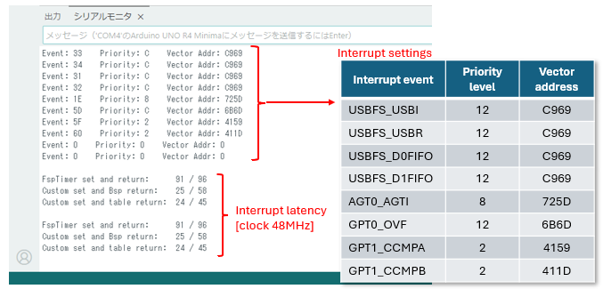
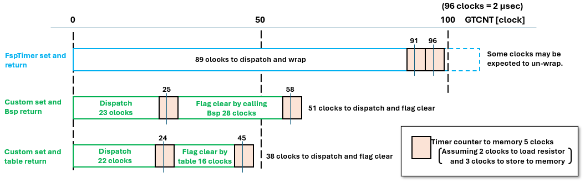

# timer_interrupt_latency_test

## 目的 / Purpose
このリポジトリは、Arduino UNO R4 (RA4M1) でGPTタイマー割り込み待機時間を測定するためのテストコードを提供します。  
FspTimerライブラリと自作ライブラリを比較し、ISRの開始/終了タイミングを記録します。  
This repository contains test code for measuring GPT timer interrupt latency on Arduino UNO R4 (RA4M1).  
It compares FspTimer library and a custom library, recording ISR entry/exit timing.  

---

## ピン接続 / Pin connection
- 不要  
- Not required  

---

## 使い方 / Usage
- 自作割り込みライブラリをインストールします  
- `timer_interrupt_latency_test.ino` をUNO R4 MINIMAに書き込みます  
- シリアルモニタを115200bpsに設定して接続します  
- 結果を確認します  
デフォルトの48MHzでは、96クロックは2μsecに相当します  
- Install the custom library  
- Upload `timer_interrupt_latency_test.ino` to UNO R4 MINIMA  
- Open Serial Monitor at 115200 bps  
- Observe results  
At the default of 48 MHz, 96 clocks equals 2 μsec.  

---

## ポイント / Key insights

  

割り込み関係のレジスタの設定をまず表示します。  
次にレスポンスの結果をクロック数で表示します。　環境により、値が数クロック変化することがあります。  
Show the interrupt related register settings first.  
Next, result of latency is shown by clock value. The value may vary by several clocks depending on the environment.  

 

  

ユーザISRに入るまでの時間は、カスタムライブラリでは0.5μsecですが、FspTimerライブラリでは2μsecです。  
自作ライブラリで割り込みフラグのクリアを含めても、合計の時間はFspTimerの方が長くなります。  
さらに、測定されていない部分 (ユーザISRから呼び出し元に戻るまでの時間) を考慮すると、FspTimerはさらに時間がかかることが予想されます。  
これらの差はμsecのオーダーですが、16～20kHzのPWMで割り込み処理を同期させるならば、このようなロスは無視できないかもしれません。  
The time to enter the user ISR is 0.5 μsec with the custom library, compared to 2 μsec with the FspTimer library.  
Even if it includes clearing interrupt flags by custom library based, the total time is longer for FspTimer library.  
Moreover, considering the unmeasured part - the return time from the user ISR back to the original execution - it is expected that FspTimer library takes longer as well.  
Although the differences are on the order of microseconds, when synchronizing interrupt handling with a 16–20 kHz PWM, such loss may not be negligible.  

---

## 特記事項 / Extra Notes
自作ライブラリでは、テストコードは割り込みフラグをクリアする方法を2種類使っています。  
- ひとつは、現在の割り込み情報を使用してR_BSP_IrqStatusClear()関数を呼び出す方法です。  
- もうひとつは、IELSRレジスタの逆引きテーブルによって決定される割り込みフラグを直接クリアする方法です。  
少し速くなりましたが、IELSRマッピングが変更される可能性があるため、この方法は推奨されません。  

For custom library based, the test code has two method to clear interrupt flag.  
- One is calling R_BSP_IrqStatusClear() function with current interrupt information.  
- Another is directly clearing interrupt flag which determined by reverse-mapping table defined from IELSR resistor.  
It was slightly faster, but since IELSR mapping may change, this method is not recommended.  

---

## 必要な環境 / Requirements
- Arduino IDE（最新版推奨） / Arduino IDE (latest recommended)  
- Arduino UNO R4 MINIMA / Arduino UNO R4 MINIMA  

---

## ライブラリのインストール / Library Installation
このプログラム例では、GPTタイマーとその割り込みの設定のために自作ライブラリが必要です。  
プログラムを実行する前に、以下のリポジトリから取得しインストールしてください：  
This example requires a custom library for timer GPT and its interrupt handling.  
Please get it from the following repository the program and install before running:  

https://github.com/inteGN/GPT_basicfunction_R4  

---

## License
Copyright (c) 2026 inteGN - MIT License  

