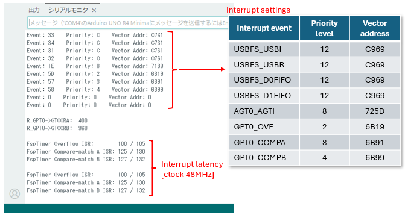

# timer_interrupt_latency_test_2

## 目的 / Purpose
このリポジトリは、Arduino UNO R4 (RA4M1) でGPTタイマー割り込み待機時間を測定するためのテストコードを提供します。  
FspTimerライブラリでオーバーフロー、コンペアマッチA、コンペアマッチBの割り込みを設定し、ISRの開始/終了タイミングを記録します。  
This repository contains test code for measuring GPT timer interrupt latency on Arduino UNO R4 (RA4M1).  
It configures Overflow, Compare-match A and Compare-match B interrupt by FspTimer library, and records ISR entry/exit timing.  

---

## ピン接続 / Pin connection
- 不要  
- Not required  

---

## 使い方 / Usage
- `timer_interrupt_latency_test_2.ino` をUNO R4 MINIMAに書き込みます  
- シリアルモニタを115200bpsに設定して接続します  
- 結果を確認します  
デフォルトの48MHzでは、96クロックは2μsecに相当します  
- Upload `timer_interrupt_latency_test_2.ino` to UNO R4 MINIMA  
- Open Serial Monitor at 115200 bps  
- Observe the results  
At the default clock of 48 MHz, 96 clocks equals 2 μsec.  

---

## ポイント / Key insights

  

割り込み関係のレジスタの設定をまず表示します。  
次にレスポンスの結果をクロック数で表示します。　環境により、値が数クロック変化することがあります。  
Show the interrupt related register settings first.  
Next, result of latency is shown by clock value. The value may vary by several clocks depending on the environment.  

 

  

割り込みが受け付けられるとまずそれぞれのラッパーISRに入り、その後ユーザISRに入って対応する処理に振り分けられます。  
振り分ける順に処理に時間がかかるのは自然ですが、それでもオーバーフローがほかよりもかなり短めです。  
ユーザーISRに入るまで約120クロック、2.5μsecは、RTOSなどに適用し1～10msecのシステム時間間隔で動作する用途では比率的に影響は小さいと思われます。  
When an interrupt is acknowledged, it first enters the respective wrapper ISR and then the user defined ISR for processing.  
It's natural that the dispatching takes longer, but the Overflow is still much shorter than the others.  
Approximately 120 clocks (about 2.5μsec) until entering the user defined ISR may be relatively small for applications such as RTOS tasks operating with system tick intervals of 1–10 ms.  

**まとめ**
- GPTの複数割り込みイベント（オーバーフロー、コンペアマッチA/B）はひとつのコールバック関数に集約されます。  
- FspTimer.hはIRQManager.hを使用して割り込みの設定を抽象化し、ほかのライブラリとの安全な共存を可能にします。  
- 測定された割り込み待機時間は、オーバーフローとコンペアマッチの間に明確な差があることを示します。  

**Conclusion**
- Multiple GPT interrupt events (overflow, compare A/B) can be handled in a single callback.  
- FspTimer.h abstracts interrupt setup through IRQManager.h, enabling safe coexistence with other libraries.  
- Measured interrupt latency shows clear differences between overflow and compare-match events.  

---

## 必要な環境 / Requirements
- Arduino IDE（最新版推奨） / Arduino IDE (latest recommended)  
- Arduino UNO R4 MINIMA / Arduino UNO R4 MINIMA  

---

## License
Copyright (c) 2026 inteGN - MIT License  

